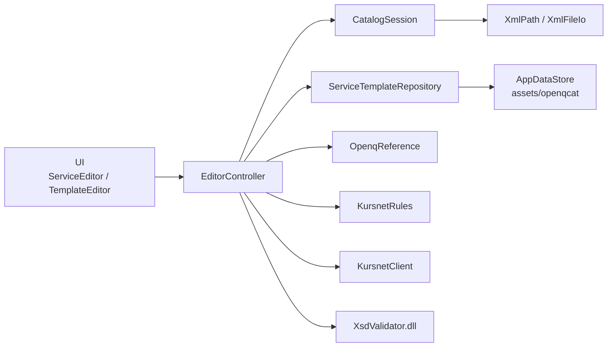

# XML Service Editor

Windows-Editor für **OpenQCat / KURSNET**-Kataloge. Aus einem Bildungsangebot plus Vorlagen (Ort, Vollzeit/Teilzeit, Header) wird gültiges OpenQCat-XML — inkl. Prüfung, Export und optionalem Upload.

Die **aktuell gepflegte App** ist der Flutter-Client unter [`flutter/`](flutter/). WinForms am Repo-Root ist der ältere Originalstand.

## Schnellstart (Flutter)

Voraussetzungen: [Flutter](https://docs.flutter.dev/get-started/install/windows) (Windows-Desktop aktiviert), optional .NET 8+ für den XSD-Validator.

```powershell
cd flutter
flutter pub get
flutter run -d windows
```

Beim ersten Start kopiert die App Schema, Vorlagen und BA-Wertebereiche in einen beschreibbaren Ordner:

`%AppData%\…\XmlEditorFlutter\`

(genau: `getApplicationSupportDirectory()` + Unterordner `XmlEditorFlutter`)

XSD-Prüfung („Gegen XSD prüfen“) braucht einmalig die NativeAOT-DLL:

```powershell
cd native
dotnet publish -c Release -r win-x64 -o publish
copy publish\xsd_validator.dll ..\flutter\native\
```

Ohne DLL läuft der Editor weiter; nur die XSD-Prüfung fehlt.

## Was die App kann

| Bereich | Funktion |
|--------|----------|
| Katalog | XML öffnen, Angebote/Termine listen, Felder bearbeiten |
| Neu | Service aus Main-Template + Ort + Beschäftigungsart |
| Termine | Veranstaltung (`EDUCATION@type=false`) an ein Angebot hängen |
| Vorlagen | Main, Beschäftigungsart, Ort, Header editieren |
| Codes | `type="…"`-Werte mit BA-Wertebereichen, Tooltips und Auswahllisten |
| Export | KURSNET-Sanitize + Validierung, iso-8859-15-kompatibel |
| Upload | SOAP `upload` (action 1 = prüfen, 2 = speichern) |
| Debug | XML-Vergleich (nur in Debug-Builds) |

## Architektur



Schichten in `flutter/lib/`:

| Schicht | Ordner | Aufgabe |
|---------|--------|---------|
| UI | `ui/` | Seiten, Dialoge, FieldGrid |
| App | `app/` | `EditorController` — Session-Fassade für die UI |
| Domain | `domain/` | Katalogregeln, Vorlagen-Mapping, Daten, Titel |
| Data | `data/` | Dateien, Profiles, Referenzlisten, SOAP |
| FFI | `ffi/` | XSD-Validator-DLL |

Ausführlicher Klassen- und Funktionskatalog: **[docs/WARTUNG.md](docs/WARTUNG.md)**  
Vorlagen anpassen: **[docs/VORLAGEN.md](docs/VORLAGEN.md)**

## Repo-Struktur

```
XmlEditorUi/
├── flutter/                 # aktuelle App
│   ├── lib/                 # Dart-Quellen
│   ├── assets/openqcat/     # Schema, Templates, Wertebereiche
│   └── native/              # Zielordner für xsd_validator.dll
├── native/                  # C# NativeAOT XSD-Validator
├── docs/                    # Wartung & Vorlagen
├── Forms/, Services/, …     # WinForms (Legacy)
├── templates/, schema.xsd   # WinForms-Kopien am Root
└── TEMPLATE_SYSTEM.md       # ältere WinForms-Notiz
```

WinForms bleibt unabhängig startbar (`dotnet run` bzw. `XmlEditorUi.sln`). Flutter und WinForms teilen **keine** Build-Outputs.

## Tests

```powershell
cd flutter
flutter test
```

Wichtige Regeln (Kursstart → Ankündigungsdaten, Export-Hülle) liegen in `flutter/test/golden/date_and_export_test.dart`.

## OpenQCat-Kurzregeln

Diese Punkte stecken in `KursnetRules` / `CatalogSession` und sollten bei Änderungen nicht „wegrefactored“ werden:

- **Angebot** `EDUCATION@type="true"` → `COURSE_ID = PRODUCT_ID`
- **Veranstaltung** `EDUCATION@type="false"` → `COURSE_ID` zeigt auf das Angebot, nicht auf die eigene `PRODUCT_ID`
- Header-`CONTACT_ROLE` im SUPPLIER: **type 2 oder 3** (Leitfaden)
- Land: **DE**, Telefon: `+49.…`
- Export ist **semantisch** KURSNET-tauglich, nicht byte-identisch zur Eingabe

## Weiterlesen

- [flutter/README.md](flutter/README.md) — Flutter-Details und Asset-Pfade
- [docs/WARTUNG.md](docs/WARTUNG.md) — Klassen, Funktionen, typische Änderungen
- [docs/VORLAGEN.md](docs/VORLAGEN.md) — Template-Felder und Mapping
